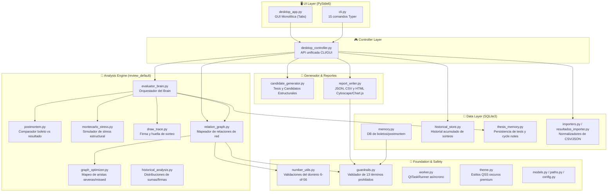
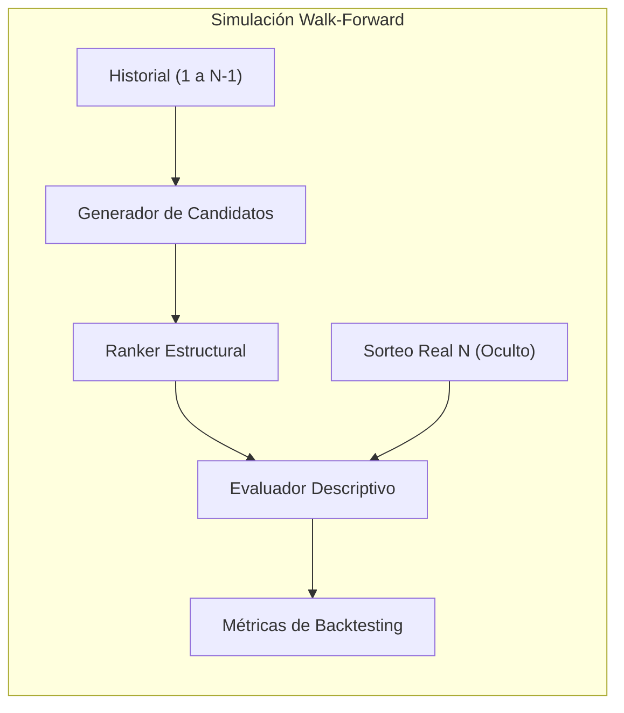

# MelateApp — Walkthrough v1.0 Final

> **Estado del Repositorio:** `feature/s5-s6-s11-ux-improvements` @ `417f02d` · **105 tests ✓** · **0 violaciones de guardrails** · **review_default**

---

## 1. Estado del Proyecto

* **Commit / Branch Actual:** Branch `feature/s5-s6-s11-ux-improvements` (Commit `417f02d`).
* **Total de Tests:** 105 tests unitarios e integrales en `tests/`.
* **Resultado de Pytest:** 105 aprobados (100% exitoso).
* **Resultado de guardrail-scan:** 0 violaciones detectadas (51 archivos validados).
* **Estado de CI:** Configurado mediante GitHub Actions para validar `pytest` en entornos sin Qt (opcionalidad de PySide6 controlada).
* **Dependencias Core:** `typer` (para CLI), standard library (`sqlite3`, `json`, `html`, `csv`, `webbrowser`, etc.).
* **Dependencias Desktop:** `PySide6` (opcional/development).
* **Python Requerido:** `>=3.11`.
* **Modo Operativo:** `review_default` (con validación estricta de términos prohibidos).

---

## 2. Resumen Ejecutivo

* **¿Qué es MelateApp?**  
  MelateApp es un Laboratorio de Inteligencia Local (CLI y GUI de escritorio) diseñado para la **revisión descriptiva y estructural** de sorteos históricos del juego Melate/Revancha de la Lotería Nacional mexicana.
* **¿Qué problema resuelve?**  
  Evita que los usuarios dependan de corazonadas o análisis manuales propensos a errores al estructurar sus sets de juego. Ofrece una auditoría técnica retrospectiva y prospectiva de firmas de bloques, bandas de suma, coaparición de parejas y concentración de anclas.
* **Flujo Antes del Sorteo:**  
  Permite explorar las coapariciones históricas en un grafo de red, y genera de manera heurística y filtrada por stress (análisis Monte Carlo) combinaciones candidatas clasificadas en perfiles de tesis de revisión.
* **Flujo Después del Sorteo:**  
  Permite capturar el resultado oficial del sorteo frente a los boletos que jugó el usuario para ejecutar un análisis de cobertura (*postmortem*), registrando aciertos (*hits*), fallos (*misses*) y extrayendo lecciones aprendidas en la base de datos local.
* **¿Qué NO hace?**  
  La aplicación **NO realiza predicciones ni promete resultados**. MelateApp está estrictamente alineada a un modelo descriptivo y metodológico, excluyendo términos comerciales de certeza, probabilidad estadística inflada o ganancia asegurada.

---

## 3. Arquitectura del Sistema



---

## 4. Inventario de Módulos (29 archivos analizados)

| Archivo | Rol | Estado | Riesgos / Deuda Técnica | ¿Refactor para v1.0? |
|---|---|---|---|---|
| `desktop_app.py` | GUI monolítica PySide6 | **DONE** | ⚠️ Monolítico de 728 líneas. Acciones complejas mezcladas en la definición de layouts. | **Sí** (Separar vistas e inicializadores). |
| `cli.py` | Interfaz de comandos Typer | **DONE** | Ninguno. Mantiene mapeo uno a uno con el controller. | No. |
| `desktop_controller.py` | API del controlador | **DONE** | ⚠️ Algunos métodos hacen operaciones de guardado directo a archivos sin control de transacciones globales. | No. |
| `candidate_generator.py` | Motor de tesis candidatas | **DONE** | Procesamiento heurístico en memoria. Puede tardar si el pool único es muy grande. | No. |
| `relation_graph.py` | Generador de grafos de coaparición | **DONE** | Ninguno. Separación exitosa entre postmortem e histórico. | No. |
| `report_writer.py` | Exportador HTML, CSV y JSON | **DONE** | ⚠️ Templating manual basado en f-strings de Python con alto riesgo de fallos por escaping de llaves. | No (ya estabilizado). |
| `resultados_importer.py` | Importador asíncrono CSV | **DONE** | El lector maneja codificaciones mediante rollback secuencial de encodings. | No. |
| `memory.py` | DB Operativa (SQLite) | **DONE** | ⚠️ `DEFAULT_DB_PATH` se unificó, pero su inicialización depende de triggers externos. | No. |
| `paths.py` | Centralizador de rutas | **DONE** | Centralización correcta. | No. |
| `guardrails.py` | Validador de guardrails | **DONE** | Validación estática a nivel de JSON/String. | No. |
| `worker.py` | Hilos secundarios de Qt | **DONE** | Captura robusta de errores que previene crashes en la UI. | No. |

---

## 5. Flujos de Usuario Actuales

### A) Flujo Antes del Sorteo
1. **Importar historial:** El usuario carga un CSV con sorteos anteriores (vía botón en tab Historial o CLI `import-history`).
2. **Abrir grafo histórico:** Abre el reporte visualCytoscape del historial acumulado (`Ver Grafo Histórico`), filtrando aristas según coapariciones (`2+`, `3+`) y seleccionando conjuntos para visualizar su soporte de coaparición en el lienzo.
3. **Generar candidatos:** Genera 10, 20 o 50 combinaciones en la pestaña "Candidatos". El motor las pre-filtra vía `stress_review` y las asocia con el soporte del grafo histórico.
4. **Revisar soporte:** El usuario estudia el reporte de candidatos en consola para ver los motivos estructurales y las IDs de sorteos que sustentan la coaparición.

### B) Flujo Después del Sorteo
1. **Captura:** El usuario ingresa el resultado oficial y los boletos que jugó.
2. **Análisis de Cobertura:** Ejecuta `Brain Review` o `Postmortem` para evaluar aciertos y fallas.
3. **Stress Review:** Evalúa de forma Monte Carlo la distribución espacial de los boletos jugados frente a la aleatoriedad.
4. **Remember:** Guarda el análisis en la base de datos local SQLite para registrar lecciones aprendidas.
5. **Report:** Genera y abre el reporte final HTML para archivar la sesión.

---

## 6. Funcionalidades Ya Implementadas (DONE)

* **Importador CSV Real (`resultados_importer.py`):** Importación en chunking, detección automática de 4 encodings, reporte de duplicados y filas erróneas en thread asíncrono.
* **Memoria Local (`memory.py` / `historical_store.py`):** SQLite centralizado para historial de sorteos y persistencia retrospectiva de análisis.
* **Visualizador Cytoscape Dual (`report_writer.py`):** Grafos HTML interactivos con filtros de aristas, ocultación de nodos aislados y overlay selector para resaltar y atenuar elementos de sets candidatos.
* **Agrupación y Ranking por Tesis (`candidate_generator.py`):** Clasifica los sets candidatos por perfiles (*Balance por bloques*, *Relacion historica moderada*, *Contraste / cobertura*), ordenándolos por `graph_support_score` descendente y agregando una nota de lectura compatible con guardrails.
* **Worker Safety (`worker.py`):** Aislamiento de procesos de larga duración en QThreads, con callback asíncrono de UI mediante `QueuedConnection` para evitar crashes por lectura cruzada de widgets.

---

## 7. Funcionalidades Parciales (PARTIAL)

* **Persistencia de candidatos de tesis:** Las combinaciones candidatas de tesis se generan al vuelo en memoria y se muestran en la consola de la UI o en terminal, pero **no se guardan** en base de datos. Si el usuario cierra la pestaña o la app, pierde los sets sugeridos.
* **Comparación visual y diversidad de sets:** No existe una forma integrada de ver la similitud o concentración entre los sets generados directamente en la UI.
* **Generación de carteras balanceadas:** CLI y GUI permiten generar sets basados en perfiles, pero no crean una cartera seleccionada y balanceada de forma automática (ej. 3 sets de bloque, 3 de coaparición, etc.).

---

## 8. Requerimientos Faltantes para Versión 1.0 Final

Para consolidar la versión **v1.0 final**, es necesario implementar:

### A. Botón de "Revisión Completa / Orquestador Maestro"
Un botón en la pestaña de Análisis (o comando `review-all`) que ejecute de forma secuencial:
1. Validación de inputs y verificación del historial disponible en SQLite.
2. Generación automática de tesis de candidatos basadas en el historial.
3. Creación del reporte HTML unificado de candidatos.
4. Generación y apertura interactiva del grafo histórico que contenga estas tesis precargadas en el selector de overlay.

### B. Cartera de Candidatos Estructurales (Persistencia y Estados)
Una pestaña o tabla interactiva en la UI llamada **"Cartera de Tesis"** que permita:
* Visualizar en una tabla los sets candidatos sugeridos actualmente.
* Cambiar su estado a: `Favorito`, `Jugado`, `Descartado` o `Pendiente`.
* Persistir estos estados en una nueva tabla SQLite (`saved_candidates`) para que no se pierdan al cerrar la app.
* Exportar la cartera seleccionada en formato JSON/CSV.

### C. Módulo Comparador de Sets y Diversidad de Cartera
Una herramienta interna (integrada en el controller y visible en UI/reportes) que analice las tesis guardadas e identifique:
* Similitud de números (si hay sets que comparten 4 o más números entre sí).
* Concentración en bloques de la cartera total (evitar que todos los sets seleccionados apunten al mismo bloque o banda de suma).
* Advertencias de sobre-concentración o redundancia estructural.

### D. Reporte Unificado de Laboratorio v1.0
Un nuevo reportero HTML consolidado que unifique:
* Datos de la ventana histórica analizada.
* La Cartera de Tesis activa (los sets favoritos/jugados con su soporte de grafo).
* El análisis del comportamiento del historial de Revancha.
* Nota descriptiva aclarando el enfoque de revisión descriptiva sin promesas de predicción.

### E. Empaquetado Windows Automatizado
Un script de PyInstaller parametrizado (`build_windows.py`) que ensamble un ejecutable portable `.exe` de MelateApp, empaquetando recursos estáticos (QSS, HTML stubs, base de datos inicial vacía, README de instrucciones).

---

## 9. Riesgos Técnicos Restantes

1. **Dependencia de Red para Cytoscape.js / Chart.js:** Los reportes HTML utilizan CDNs de Cloudflare para las librerías Cytoscape y Chart.js. Si el usuario opera de forma offline, los reportes mostrarán la tabla de fallback pero no los gráficos interactivos.  
   *Mitigación:* Añadir copias locales de estas librerías JS en la carpeta de recursos e inyectarlas localmente si están disponibles, manteniendo el CDN como fallback secundario.
2. **Monolito en `desktop_app.py`:** La UI de escritorio de 728 líneas es propensa a fallos si se añaden demasiadas funcionalidades en la misma función monolítica.  
   *Mitigación:* Modularizar la inicialización de cada Tab en submódulos o clases helper independientes dentro de `melate_app_lab/desktop/`.
3. **Escapes de Llaves en `report_writer.py`:** El uso de f-strings para inyectar JavaScript genera alta probabilidad de SyntaxError en Python (ej. el fallo con corchetes en el tap handler).  
   *Mitigación:* Utilizar templates basados en `string.Template` o procesar reemplazos dirigidos (`replace()`) en lugar de f-strings gigantescos.

---

## 10. Plan de Implementación v1.0 Final (PRs Pequeños)

### PR v1.0-1 — Orquestador de Revisión Completa
* **Objetivo:** Implementar la acción unificada de revisión que conecte historial, candidatos y grafos en un solo reporte HTML.
* **Archivos:** `desktop_controller.py`, `desktop_app.py`, `cli.py`, `report_writer.py`.
* **Tests:** Validar que la ejecución conjunta genera y abre el reporte sin errores.
* **Criterio de Done:** Un botón en UI genera los candidatos, el grafo histórico asociado, los guarda temporalmente y abre el navegador automáticamente con el dashboard HTML y el grafo enlazado.

### PR v1.0-2 — Persistencia y Cartera de Tesis
* **Objetivo:** Crear la tabla SQLite de candidatos guardados y la interfaz de usuario en GUI para interactuar con la cartera de tesis.
* **Archivos:** `memory.py`, `desktop_controller.py`, `desktop_app.py`.
* **Tests:** Validar en `test_memory.py` operaciones CRUD de candidatos con estados (`Favorito`, `Jugado`, `Descartado`).
* **Criterio de Done:** Pestaña "Cartera de Tesis" activa en GUI mostrando los sets guardados persistentes entre reinicios de la aplicación.

### PR v1.0-3 — Comparador de Sets y Alertas de Concentración
* **Objetivo:** Algoritmo de similitud para evaluar la diversidad de la cartera y advertir al usuario sobre redundancias.
* **Archivos:** `number_utils.py`, `desktop_controller.py`, `desktop_app.py`.
* **Tests:** Escribir pruebas en `tests/test_number_utils.py` que comprueben la distancia de intersección entre combinaciones.
* **Criterio de Done:** Alertas visibles en el panel de cartera de tesis cuando dos combinaciones tienen más de 4 números iguales o pertenecen al mismo bloque redundante.

### PR v1.0-4 — Reporte Consolidado v1.0 e Inyección Offline de CDNs
* **Objetivo:** Unificar reportes HTML y añadir fallback de archivos JS locales para operación completamente offline.
* **Archivos:** `report_writer.py`, `paths.py`, creación de directorio `resources/`.
* **Tests:** Confirmar la carga offline simulando ausencia de red.
* **Criterio de Done:** Reporte consolidado HTML autoejecutable sin requerir conexión a internet.

### PR v1.0-5 — Script de Empaquetado Windows
* **Objetivo:** Automatizar el empaquetado PyInstaller a través de un script dedicado.
* **Archivos:** Creación de `scripts/build_windows.py`.
* **Tests:** Ejecutar el build en Windows y correr el ejecutable resultante.
* **Criterio de Done:** MelateApp compilado en un archivo ejecutable portable en la carpeta `dist/` que incluye todas las dependencias.

---

## 11. Roadmap v1.1: ML Lab / Backtesting Estructural

Este módulo introduce una capa analítica para realizar evaluaciones retrospectivas de las tesis de revisión y los candidatos estructurales frente a un baseline aleatorio controlado, sin involucrar afirmaciones predictivas o de ganancia.

### A) Plan Técnico e Integración de Walk-Forward
El laboratorio de backtesting implementará una metodología de **evaluación retrospectiva tipo walk-forward**. Para un conjunto de sorteos históricos seleccionados, el sistema reconstruirá el estado de la base de datos exactamente como existía en ese momento en el tiempo (ocultando los sorteos futuros para evitar sesgos de anticipación o *lookahead bias*), generará y rankeará candidatos, y medirá el desempeño del ranker comparado con el resultado real ocurrido en el sorteo inmediatamente posterior.



### B) Archivos a Crear

#### 1. [NEW] `melate_app_lab/feature_extractor.py`
Convierte combinaciones de 6 números en un vector estructurado de propiedades (features):
* Propiedades básicas: `sum`, `sum_band` (ordinal/categorical), `block_signature`, `block_presence_signature`, `parity_signature`.
* Conectividad y red: `graph_support_score`, `pair_edges_count` (número de parejas observadas en la ventana).
* Frecuencia e historial: `frequency_features` (media y desviación estándar de la frecuencia individual de sus números en la ventana), `degree_features` (grados y grados ponderados en el grafo), `diversity_score` (dispersión por bloques), `historical_exact_match` (booleano).

#### 2. [NEW] `melate_app_lab/candidate_search.py`
Gestiona el motor de muestreo y filtros estructurales primarios:
* Generación reproducible usando una semilla aleatoria controlada (`seed`).
* Filtrado estricto para evitar duplicados del historial.
* Distribución del pool inicial según perfiles: balance de bloques, coaparición por grafos, contraste espacial y cobertura.

#### 3. [NEW] `melate_app_lab/candidate_ranker.py`
Establece el motor de puntuación descriptiva por reglas (Heuristic Ranker):
* Suma de puntuaciones ponderadas basadas en:
  - Soporte de grafo histórico (mayor coaparición ponderada).
  - Cobertura espacial (diversidad de bloques y paridad).
  - Ajuste a distribuciones empíricas de sumas y firmas de la ventana.
* Penalizaciones por sobre-concentración de anclas o redundancia estructural.

#### 4. [NEW] `melate_app_lab/backtest_lab.py`
Orquesta la simulación walk-forward temporal:
* Itera sobre una lista de sorteos objetivos.
* Define una ventana de entrenamiento/historial anterior (ej. 30 sorteos).
* Ejecuta la búsqueda de candidatos, extrae sus características, aplica el ranker y registra la posición (*rank*), aciertos (*hits*) y deciles de desempeño del resultado real frente a los candidatos.
* Compara los resultados contra un **baseline aleatorio controlado** para verificar si las tesis estructurales demuestran una señal de selección superior a la aleatoriedad.

#### 5. [NEW] `melate_app_lab/ml_ranker.py`
Capa opcional de aprendizaje automático (dependencia opcional `[ml]`):
* Entrena modelos supervisados clásicos (clasificadores o regresores lineales/árboles) para ajustar las ponderaciones del ranker a partir del comportamiento histórico.
* *Nota:* No se incluye deep learning en el core; se mantiene aislado bajo dependencias opcionales.

### C) Archivos a Modificar

#### 1. [MODIFY] `melate_app_lab/cli.py`
* Añadir comando `backtest`: ejecuta la simulación walk-forward en consola y reporta métricas.
* Añadir comando `search-candidates`: genera un pool crudo de candidatos.
* Añadir comando `rank-candidates`: ordena y puntúa un archivo/set de combinaciones.

#### 2. [MODIFY] `melate_app_lab/report_writer.py`
* Agregar `write_backtest_report_html`: reporte interactivo visual con curvas de desempeño retrospectivo del ranker vs baseline.
* Agregar `write_candidates_catalog_html`: catálogo visual de candidatos ordenados por rango.

#### 3. [MODIFY] `melate_app_lab/desktop_app.py`
* Agregar pestaña **"ML Lab & Backtest"** con parámetros de ventana, tamaño de simulación, semilla aleatoria y un visor de las métricas descriptivas resultantes.

---

## 12. Plan de Implementación v1.1

### PR v1.1-1 — Feature Extractor y Candidate Search
* **Objetivo:** Construir la base de generación de candidatos y extracción de propiedades del dominio 6-of-56.
* **Archivos:** `melate_app_lab/feature_extractor.py`, `melate_app_lab/candidate_search.py`.
* **Tests:** Comprobar vector de features correcto para combinaciones conocidas; validar que la generación no produce duplicados históricos y responde a la semilla (`seed`).

### PR v1.1-2 — Candidate Ranker por Reglas
* **Objetivo:** Implementar la lógica de scoring no-ML que pondere la adecuación del set.
* **Archivos:** `melate_app_lab/candidate_ranker.py`.
* **Tests:** Comprobar que combinaciones con alto soporte de grafo y firma optimizada obtienen puntuaciones superiores a conjuntos desbalanceados.

### PR v1.1-3 — Motor de Backtesting Walk-Forward
* **Objetivo:** Implementar el simulador temporal libre de lookahead bias y su baseline de control.
* **Archivos:** `melate_app_lab/backtest_lab.py`, `melate_app_lab/cli.py` (comando `backtest`).
* **Tests:** Comprobar que en el sorteo N solo se alimentan datos de sorteos $< N$; verificar que el baseline aleatorio es reproducible.

### PR v1.1-4 — Interfaz de Usuario y Reportes Visuales
* **Objetivo:** Exponer la pestaña de Backtesting en la GUI y exportar reportes HTML descriptivos.
* **Archivos:** `melate_app_lab/desktop_app.py`, `melate_app_lab/report_writer.py`.
* **Criterio de Done:** Se puede ejecutar el backtest en segundo plano desde el escritorio, ver la barra de progreso y abrir el reporte HTML en el navegador.

### PR v1.1-5 — Ranker ML Opcional (Scikit-Learn)
* **Objetivo:** Añadir soporte de machine learning clásico opcional.
* **Archivos:** `melate_app_lab/ml_ranker.py`, `pyproject.toml`.

---

## 13. Decisión Arquitectónica: ML Clásico vs Red Neuronal

Se ha tomado la decisión de priorizar **ML Clásico (Scikit-Learn) primero** sobre redes neuronales directas debido a las siguientes razones:
1. **Interpretabilidad de Atributos:** Permite calcular de forma directa la importancia de cada característica (ej. peso relativo de las firmas vs coaparición).
2. **Prevención de Sobreajuste (Overfitting):** El historial de sorteos de Melate es pequeño para los estándares de deep learning (pocos miles de registros). Los modelos de árboles de decisión (Random Forest, Gradient Boosting) o regresores lineales regularizados (Lasso/Ridge) son significativamente más estables en estas condiciones.
3. **Complejidad y Dependencias:** Mantiene el núcleo de la aplicación extremadamente ligero, cayendo bajo una bandera de instalación opcional.

---

## 14. Validación de Comandos e Instrucciones de Desarrollo

### Comandos de Validación Operativa
```powershell
# Ejecución de tests unitarios
py -3 -m pytest

# Verificación de términos prohibidos
py -3 -m melate_app_lab guardrail-scan

# Consulta de configuración del analista
py -3 -m melate_app_lab llm-status

# Carga de datos de sorteos
py -3 -m melate_app_lab import-history --file "data\revancha.csv"

# Obtener tesis desde CLI
py -3 -m melate_app_lab theses --count 10 --game revancha

# Lanzar GUI local
py -3 -m melate_app_lab desktop
```

---

## 15. Directrices para Agentes

### Para Gemini (Implementador)
```
MODO IMPLEMENTADOR EFICIENTE.
Implementa solo el PR asignado según el plan de WALKTHROUGH_V1_FINAL.md.
No añadas dependencias externas no especificadas.
Respeta los términos descriptivos y evita palabras prohibidas.
Prueba localmente ejecutando pytest y guardrail-scan antes de dar por terminado el trabajo.
```

### Para Claude (Planificador / Revisor de Código)
```
MODO ARQUITECTO.
Revisa los archivos modificados para el PR.
Verifica la opcionalidad de PySide6, la persistencia en SQLite y que no se usen términos promocionales o predictivos.
Entrega veredicto: Approved / Changes requested.
```

